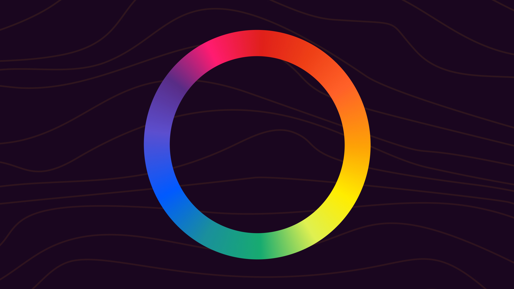

# LED Color Configuration

The LED ring color and brightness can be configured without reflashing. Changes are stored in flash and persist across power cycles.

## Color wheel

The device cycles through the standard RGB color wheel:



Twist clockwise to advance through the colors (red → yellow → green → cyan → blue → magenta → red).

## On-device configuration (button hold)

With the device connected, hold both buttons for 6 seconds. The device will complete its normal 3-second calibration, then enter color config mode.

**Step 1 — Brightness:** The ring breathes at the current color. Twist the knob to adjust brightness. Right button to confirm, left button to cancel.

**Step 2 — Color:** The ring breathes through the selected color. Twist the knob to cycle through the color wheel. Right button to save, left button to cancel.

## Runtime configuration (USB serial)

Connect a serial terminal at 115200 baud and send commands:

```
led show               — print current brightness and color
led brightness <0-255> — set brightness
led color <RRGGBB>     — set idle color (hex, e.g. led color FF8800)
led reset              — restore firmware defaults
```
